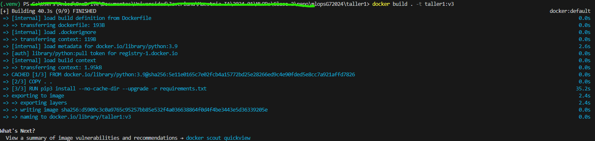
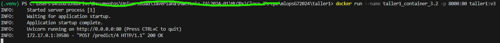
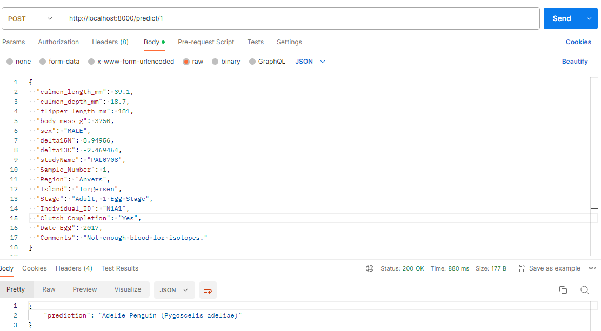
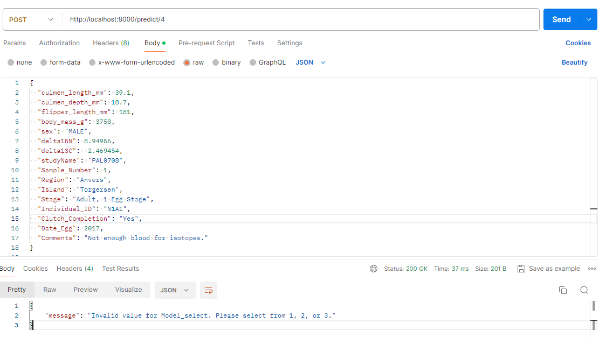
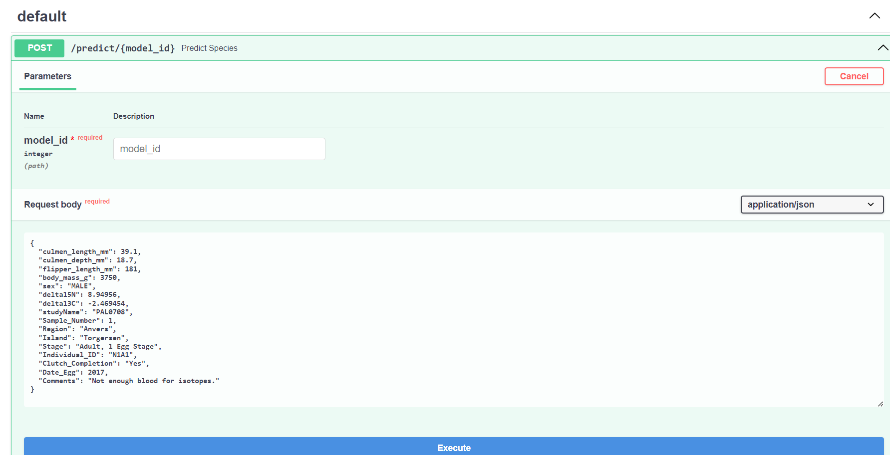

# Curso de MLOPs - Taller 1

## Prerequisitos
Antes de comenzar se debe tener instalado:
- Python 3.9
- Docker
- Postman

## Componentes principales

El programa se compone de los siguientes archivos:

1. data_prep.py: en este programa se realiza el preprocesamiento de los datos y el entrenamiento de los modelos.
     -   Como paso inicial se carga el archivo "penguins_lter.csv", al que posteriormente, como primer paso del preprocesamiento, se le eliminan las variables que no serán utilizadas para entrenar el modelo.
     -   En segundo lugar, se reemplazan aquellas variables que se consideran como ruido por np.nan. En el caso de este dataset solo se observó que  algunas de las entradas de la variable "Sex" eran populadas por el valor "."
     -   En Tercer lugar, se realizó el cambio de variables de Objeto a categórica para "Species" y "Sex"
     -   Posteriormente el dataset fue dividido en subgrupos Train y test, con una relacion 70-30.
     -   Usando el subgrupo Train, se crearon 2 pipelines para las variables numéricas y categóricas en donde, para las variables numéricas, se reemplazaron los valores vacíos por medio del método K vecinos más cercanos, para utilizar un valor promedio de los datos de aquellas entradas con una similitud más cercana al valor que se buscaba completar. Para las variables categóricas se utilizó el método "SimpleImputter" para reemplazar el valor faltante por el valor más común, luego se implementó el método OneHotEncoder para codificar dichas variables.
     -   Como último paso se utilizó la función ColumnTransformer para concatenar los datos categóricos y numéricos en un único dataset, dado que habían sido previamente separados para implementar los pipelines para cada categoría (num, cat).
     -   ENTRENAMIENTO: Para cargar cada uno de los 3 modelos se utilizó un Pipeline para implementar los pasos de preprocesamiento a los datos de entrada y luego implementar el modelo. Para el modelo Random forest se utilizo la función GridSearch para seleccionar los parámetros que dieran el mejor valor de f1_score. Para los demás modelos solo se implementó un pipeline y se utilizaron los hiperparametros por defecto. Cada modelo, incluyendo el Pipeline, fue guardado usando la librería joblib.

2. peng_model.py: En este archivo se definen las variables de entrada del programa, y se crea la clase Penguinmodel que contiene las funciones _load_model y predict_species.
     - _load_model: carga el modelo .joblib mediante la variable Model_select, la cual define que modelo debe ser utilizado (valores entre 1 y 3)
     - predict_species: realiza la predicción de la especie del pinguino en función de las variables de entrada definidas por usuario y retorna la especie predecida. antes de utilizarse los datos, estos son convertidos en un Dataframe para luego ser ingresados al modelo previamente entrenado.

3. main.py: Es el archivo donde se inicializa la aplicación y a su vez publica la URL que vamos a usar para la predicción.

## Despliegue y configuración
En esta sección vamos a mostrar como configurar  un contenedor de docker y su posterior consumo en un ambiente local. 

###  Dockerfile
En este archivo se declaran las instrucciones para que la imagen docker tenga lo necesario al ser ejecutada. Tambien tenemos un archivo .dockerignore que evitará que copiemos archivos irrelevantes dentro la imagen que vamos a crear.

### requirements.txt
Contiene todas las dependencias python necesarias para arrancar la aplicación dentro de Docker.  

### Repositorio
- Debemos abrir la consola de windows(cmd) o de linux(terminal) e ir al directorio donde deseamos descargar el repositorio.
- Nuestro repositorio es público, por los que se puede descargar sin problemas. Ejecutamos el siguiente comando:
  ```git clone  https://github.com/eaanillol/mlopsG72024.git```

### Ejecutar contenedor de Docker
1. En la consola vamos al directorio donde se encuentra el proyecto taller1.

2. Luego de ubicarnos dentro de la carpeta taller1, construimos la imagen docker con el siguiente comando:   
``` docker build . -t image_name:version_name ```


3. Al finalizar procedemos a correr el contenedor:
``` docker run --name container_name -p 8000:80 image_name:version_name```


### API
Con el contenedor corriendo, el servicio ya puede ser utilizado con la URL  local:
http://localhost:8000/predict/{model_id}

Como podemos apreciar, debemos enviar el identificador del modelo a utilizar en la URL del request. Los posibles valores para la variable {model_id} son:
- 1 para Random Forest.
- 2 para SVM.
- 3 para Regresión Líneal.

Si deseamos probar con **Postman**, creamos un nuevo request tipo POST. Para efectos del ejemplo vamos a usar el modelo número 1(Random Forest):
``` http://localhost:8000/predict/1 ```


Si ingresamos un identificador fuera del Rango, por ejemplo:
``` http://localhost:8000/predict/4 ```

Obtendremos un mensaje de modelo no encontrado:


El proyecto también tiene habilitada una URL de **swagger**, en la cual también se puede probar el endpoint:
``` http://localhost:8000/docs ```

