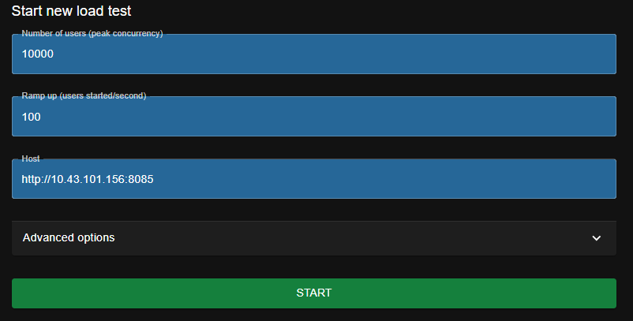

# Publicar imagen en Dockerhub #
Antes de comenzar como prerequisito debemos tener una cuenta creada en dockerhub. Luego, ingresamos al servidor virtual  10.43.101.156, cuando estemos ahí vamos la carpeta ``` "/home/estudiante/mlopsG72024/proyecto2/ ``` y ejecutamos el comando ``` docker image ls ```. Con esto podemos ver la imagen de la api que ya está creada (proyecto2-mi_api).

Para poder hacer push al repositorio en dockerhub debemos hacer lo siguiente:
- Loguearnos con la cuenta de dockerhub: ``` docker login -u anloder4 ```
- Digitamos la clave del usuario.
- Renombramos el tag de la imágen: ``` docker tag proyecto2-mi_api anloder4/proyecto2-mi_api ``` 
- Hacemos push al repositorio: ```  docker push anloder4/taller4-mi_api_repo:latest ``` 

Con esto la imágen ya se encuentra publicada en nuestra cuenta de dockerhub.

 

# Ejecución #
Para levantar el servicio en el servidor debemos realizar los siguientes pasos:
- Digitamos ``` sudo su ``` para loguearnos como root.
- Ingresamos la clave.
- Desde la consola, vamos al directorio ``` "/home/estudiante/mlopsG72024/proyecto2/ ```
- Estando en la carpeta proyecto2 ejecutamos ``` docker compose up ```, para levantar el docker de proyecto 2, cuya inferencia creada en FastAPI fue utilizada para implementar la libreria de locust.
- Previo a acceder a la interfaz de locust, verifica que la api de proyecto 2 funcione adecuadamente, ingresando a la URL  http://10.43.101.156:8085/  y ejecutando la predicción, si en el response body no aparece un mensaje de error, estamos listos para ejecutar locust.
- Una vez levantado el docker de proyecto 2, ejecutamos ``` docker compose -f docker-compose-locust.yaml up --build ``` en una nueva ventana del terminal para levantar el docker que ejecuta la instancia de locust.
- desde la URL http://10.43.101.156:8089/ se puede acceder a la interfaz de locust, desde la cual se pueden realizar las pruebas de carga correspondientes, utilizando las siguientes credenciales:

 

# Resultados de las pruebas #

Se configuraron diferentes recursos hasta identificar los valores minimos necesarios para que el sistema soportara 10.000 peticiones, de los cuales

1. En el primer test, se habilitó solo 1 CPU y 200M de memoria, en donde el sistema falló luego de 4000 peticiones.
 

2. En el segundo test, se habilitaron 2 CPU y 200M de memoria, en donde el sistema falló luego de 6000 peticiones.
 

3. Finalmente, en el tercer test, se habilitaron 2 CPU y 500m de memoria, en donde el sistema logró estabilizarse despues de las 10000 peticiones.
 

# Entorno #

Para establecer la conexión entre el docker de locust y de FastAPI, se agregaron las siguientes lineas de codigo en ambos docker compose:
```
networks:
  network1:
      name: proyecto2_default
      external: true
```
networks: Esta es la clave principal bajo la cual se definen todas las redes que los contenedores en este Docker Compose podrían usar.
network1: Este es el nombre local de la red dentro de este archivo de Docker Compose.
name: proyecto2_default: Esto especifica el nombre real de la red en el entorno de Docker. Esto es útil cuando tus contenedores necesitan comunicarse con otros contenedores que ya están corriendo bajo esta red en específico.
external: true: Esta línea indica que la red es externa y no será creada por Docker Compose al ejecutar el archivo. Docker Compose asume que la red ya ha sido creada externamente (por otro proyecto Docker Compose en este caso).

Se creó uin docker-compose-locust, el cual configura un entorno con un maestro y un trabajador de Locust para realizar pruebas de carga, utilizando una red externa para conectar ambos servicios.

- locustmaster: Maestro que coordina las pruebas de carga. Construye su propia imagen a partir de Dockerfile_locust, la cual contiene la imagen y descarga las librerias presentes en el archivo requirementes_locust.txt. Este maestro mapea el puerto 8089 para acceder a su interfaz web, monta el directorio actual para acceder a locustfile.py, y se ejecuta con comandos específicos para funcionar como maestro.
- locustworker: Trabajador que ejecuta las pruebas bajo la coordinación del maestro. Similar al maestro en configuración de construcción y montaje, pero su comando inicia como trabajador y se conecta al maestro.

Posteriormente, se crear un script locustfile.py, el cual es útil para probar la carga y el rendimiento de un servidor de predicciones de ML, simulando múltiples usuarios que envían datos al modelo de manera constante y midiendo cómo maneja el servidor estas solicitudes bajo carga. con las siguientes caracteristicas:

- class MLModelLoadTester(HttpUser): Define una clase de usuario para Locust que simula la interacción con un servicio web.
- wait_time = constant(1): Todos los usuarios simulados esperarán exactamente 1 segundo entre tareas.
- host = "http://10.43.101.156:8085": Define la dirección del servidor de FastAPI que será objetivo de las pruebas.
- self.client.post("/predict", data=json.dumps(payload), headers=headers): Envía una solicitud POST al endpoint /predict con los datos serializados en formato JSON y los encabezados adecuados.
